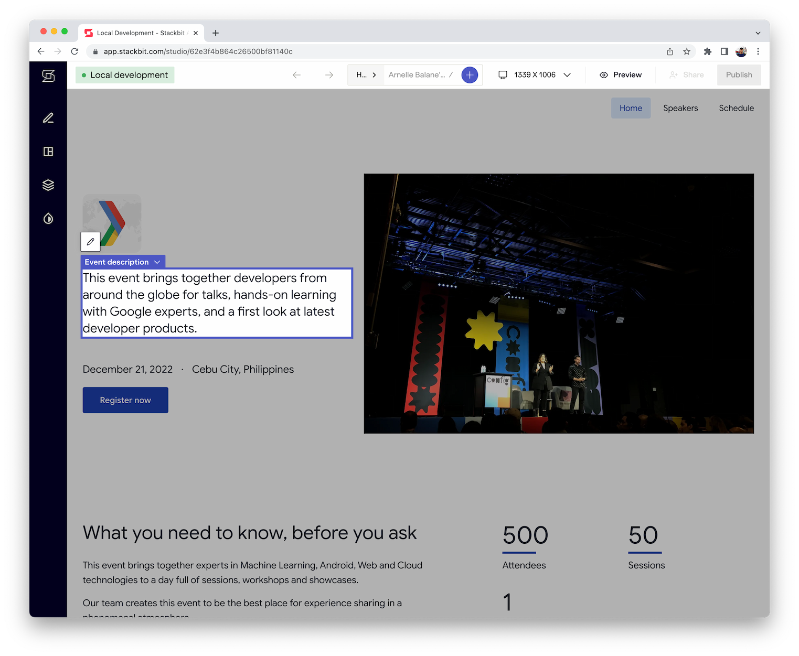

# Getting started: We manage the event website

This approach gives us more control over the project repository and hosting of our event website. We can still use the Stackbit editor to manage the content and collaborate with other users.

1. Create a new repository that uses this project as the template

   1. [Use this link](https://github.com/gdg-cebu/event-website/generate) to do that quickly

1. Clone the new repository, install dependencies, and run it locally

   ```bash
   git clone https://github.com/your-account/your-event-website
   cd your-event-website

   npm ci
   npm run dev
   # visit the site at http://localhost:3000
   ```

1. Run the Stackbit editor locally (technically we still access the online Stackbit editor, but all changes are saved directly to our local project)

   ```bash
   npx stackbit dev
   # then follow the instructions in the console output
   ```

   

## Import the project to the Stackbit dashboard

If we want other users to be able to manage the event website content, we need to import our repository into the Stackbit dashboard.

1. From the Stackbit dashboard, click on the **New project** button
1. Click on the **Create from GitHub** button
1. Choose the **Use my repository** option and click **Next**
1. Choose the repository that we just created in the previous steps, then click **Validate**
1. We can leave the advanced options with the default values and click **Next**
1. Give the project a name, then click **Create Project**
1. It will take a while to spin up a fresh project, but once it's done we can start editing the content, adding new pages, and publishing the event website.

## Deployment

We can deploy the our new project to [Netlify](https://netlify.com/) or [Vercel](https://vercel.com/), although we have to configure it manually.
