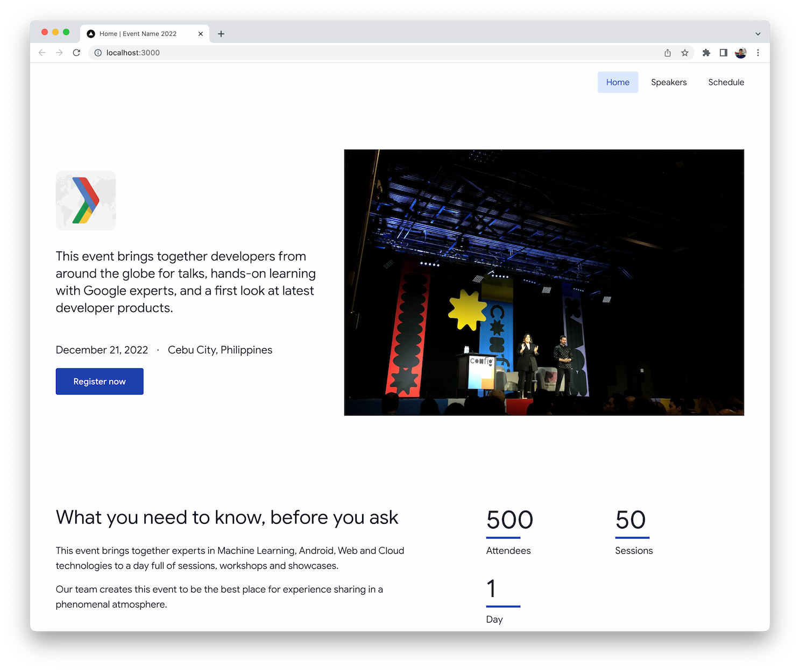

# Event Site Template

Quickly spin up a new Stackbit-enabled website for your next event. Built with [Next.js](https://nextjs.org/), [TailwindCSS](https://tailwindcss.com/), and [Stackbit](https://www.stackbit.com/).



## Contributing

Any contribution to make this project better is welcome! Get started by cloning and running this template locally:

```bash
git clone https://github.com/gdg-cebu/event-website.git
cd event-website

npm ci
npm run dev
# visit the site at http://localhost:3000

# run the stackbit editor, then follow the instructions in the console
npx stackbit dev
```

## License

[MIT License](license)
